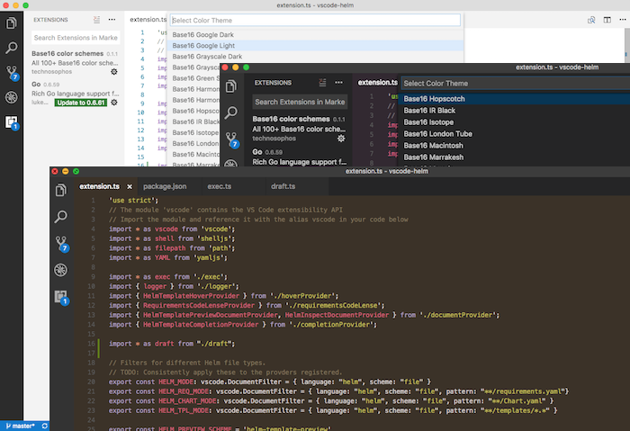

# Base16 Theme Pack

Because what you really need is 60+ hacker-oriented color schemes from which to choose.

[Base16](http://chriskempson.com/projects/base16/) is a set of themes that can be shared across multiple tools, from VIM and Emacs to your command prompt or shell.

Preview all of the themes at the [base16 theme site](http://chriskempson.com/projects/base16/)

This extension contains 60+ of the base16 themes. It provides VS Code wrappers for the [TextMate version](https://github.com/chriskempson/base16-textmate) of the Base16 themes.

**Other Base16 Themes**: This may not be the VS Code Base16 port for you. If you want just one or two of the themes, you may want to just seach the [marketplace](https://marketplace.visualstudio.com/search?term=base16&target=VSCode&category=All%20categories&sortBy=Relevance) for the one(s) you want. There is also another pack of base16 themes that appears to contain [most of the themes](https://marketplace.visualstudio.com/items?itemName=AndrsDC.base16-themes). I didn't find that one until after creating this one, and am not sure of the details.

## Customizing (Disabling Themes)

Yes, 60 can be a lot. As far as I know, the only way to disable a theme is to edit this theme's `package.json` and remove the themes you do not like. If you know of a better way, please let me know.
